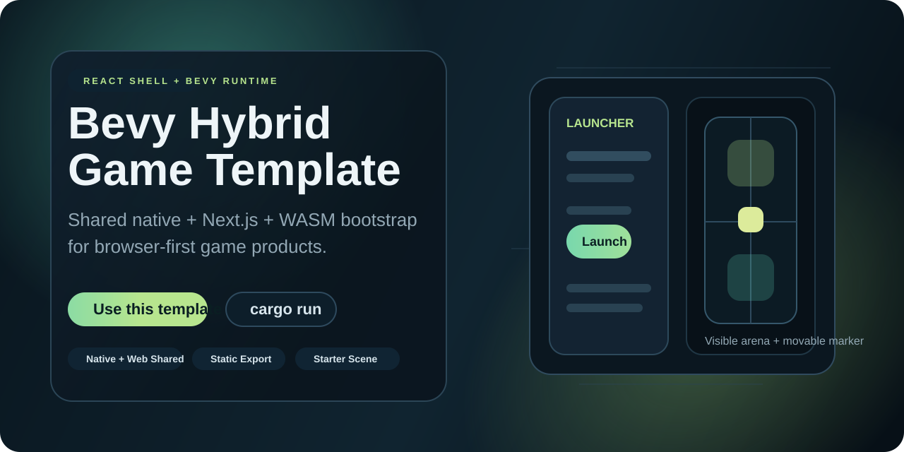
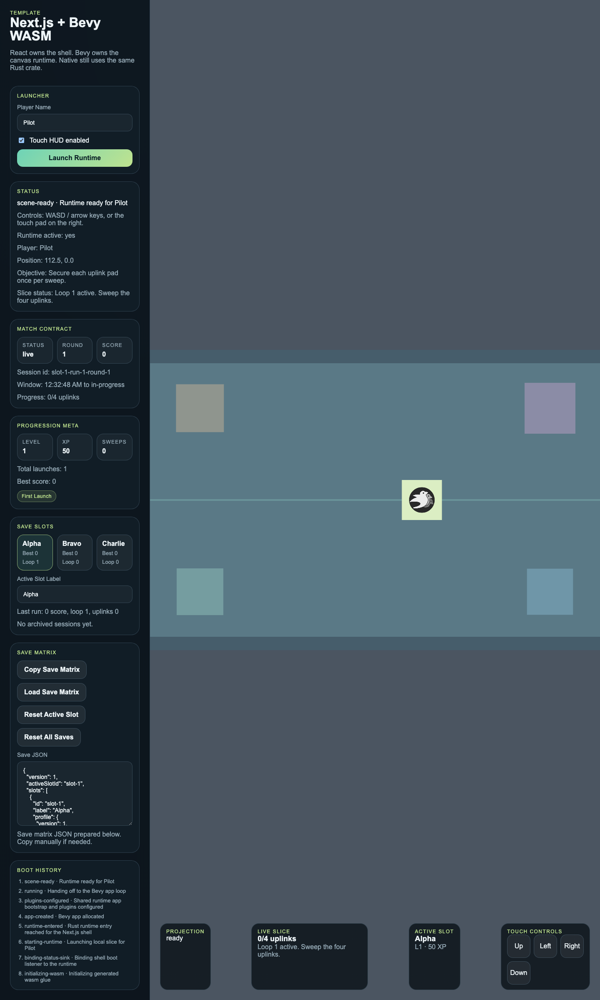

<p align="center">
  
</p>

# Numeron

<p align="center">
  <strong>One Rust runtime crate. Native Bevy + Next.js shell + Bevy WASM.</strong>
</p>

<p align="center">
  <a href="https://github.com/Zombieliu/numeron">GitHub Repo</a>
  ·
  <a href="./TEMPLATE_SETUP.md">Template Setup</a>
  ·
  <a href="./docs/COMMERCIAL_TEMPLATE_GUIDE.md">Commercial Guide</a>
  ·
  <a href="./apps/web">Web Shell</a>
  ·
  <a href="./src/runtime_app.rs">Shared Bootstrap</a>
</p>

<p align="center">
  
</p>

Reusable game starter for teams that want one Rust gameplay/runtime crate shared
across:

- native Bevy builds
- `Next.js` product shell / launcher / HUD
- `Bevy WASM` embedded into a web or PWA surface

## What It Is

This template is opinionated about ownership boundaries:

- `React / Next.js` owns product UI, launcher flows, PWA shell, account UI, and overlays
- `Bevy` owns the canvas runtime
- the same Rust crate powers both native and web targets

The web build targets static export, so the shell can be deployed to GitHub
Pages, Netlify, Cloudflare Pages, or any other static host after `pnpm build`.

If you plan to publish this repo as your own GitHub template, follow the rename
and packaging checklist in [`TEMPLATE_SETUP.md`](./TEMPLATE_SETUP.md).

## Product Read

This repo is now packaged as a starter kit, not just a runtime spike. It ships
three layers:

- `runtime core`
  shared Bevy bootstrap, wasm bridge, scene, input, and native/web runtime path
- `product shell`
  Next.js launcher, HUD, save slots, match/session panel, progression meta
- `shipping path`
  static export, native packaging scaffolding, and smoke-tested browser CI

See the visual map in [`docs/capability-map.svg`](./docs/capability-map.svg).

## Snapshot

- `cargo run` starts the native runtime
- `pnpm dev` starts the Next.js shell and embedded Bevy WASM runtime
- `pnpm build` exports a static web artifact from `apps/web/out`
- `pnpm smoke:web` boots the shell, launches the runtime, and validates scene/input flow
- `SMOKE_REMOTE_BACKEND_URL=http://127.0.0.1:8787 pnpm smoke:web` also validates the shell's remote data-mode path against the optional backend
- `pnpm rename:template -- ...` rewrites the default template identity across core files
- `pnpm backend:dev` starts the optional headless Bevy backend reference
- `src/runtime_app.rs` keeps native and web bootstrap logic on one contract
- `src/starter_scene.rs` gives every new project a visible first slice with objectives, score, and shell-visible runtime state
- the web shell now includes a local-first save matrix with slots, match/session state, progression meta, and JSON export/import

## Why This Template

Use this when you want:

- a browser-first game shell without giving up native builds
- React-owned menus and product UX around a Bevy runtime
- one reusable runtime bootstrap instead of separate native and web app setup
- a visible starter scene that proves the runtime is alive on first launch

If you only need a pure Bevy web build with no React/PWA shell, use a simpler
web-first setup elsewhere. This repo is specifically for `Next.js + embedded
Bevy runtime`.

## What You Get

- native Bevy runner with `cargo run`
- `wasm-pack` build path for the Bevy runtime
- `Next.js` app shell in [`apps/web`](./apps/web)
- shared Rust bootstrap for both native and web entrypoints
- a visible starter scene that proves the runtime is live on first launch
- a small gameplay loop with uplink capture progress, score, and repeating rounds
- local save-slot persistence for preferences, last run, best run, progression meta, and recent sessions
- optional headless Bevy backend reference for remote profile/session authority
- minimal shell-to-runtime bridge:
  - boot status sink
  - runtime event sink
  - runtime session config
  - virtual input forwarding
  - runtime projection data for shell HUDs
- mobile/release packaging scaffolding from the original Bevy template

## Quick Start

### Prerequisites

- `rustup`
- `wasm-pack`
- `node >= 20`
- `pnpm`

### Run native

```bash
cargo run
```

or

```bash
pnpm native
```

### Run web shell

```bash
pnpm install
pnpm dev
```

This will:

1. build the Rust runtime to `apps/web/public/bevy-runtime/pkg`
2. start the Next.js shell in `apps/web`

Then open:

- `http://127.0.0.1:3000`

The starter slice should boot into a visible arena with a movable player marker.

### Run optional headless backend

```bash
pnpm backend:dev
```

This starts the reference backend at `http://127.0.0.1:8787`.

Available endpoints:

- `GET /health`
- `GET /snapshot`
- `GET /profiles`
- `GET /profiles/:slot_id`
- `PUT /profiles/:slot_id`
- `GET /sessions`
- `POST /sessions`
- `PATCH /sessions/:session_id`

### Build web shell

```bash
pnpm build
```

Static output is written to `apps/web/out`.

If you deploy under a subpath, set `NEXT_PUBLIC_BASE_PATH=/your-path` before
`pnpm build`. The GitHub Pages workflow does this automatically for project
pages repos.

### Build only the wasm runtime

```bash
pnpm runtime:build:dev
pnpm runtime:build:release
```

### Run browser smoke

```bash
pnpm smoke:web
```

This builds the web export when needed, serves the generated static shell on a
local port, launches Chromium, clicks `Launch Runtime`, waits for
`scene-ready`, sends virtual input, and saves smoke artifacts under
`output/playwright/smoke-web`.

## Who This Fits

Use this template when you want to ship a game with:

- Bevy as the simulation/runtime layer
- React/Next.js as the product surface
- a web/PWA-first shell that still preserves native builds
- a shell-owned data model for saves, sessions, and progression

Skip it if your project only needs a pure Bevy app with no product shell.

## Shell Product Layer

The web shell now ships with a local-first product shell contract:

- three save slots
- slot-scoped preferences
- match/session state derived from the runtime slice
- progression meta with XP, level, sweeps, and unlock badges
- recent session history
- JSON export/import for the whole save matrix

This is intentionally shell-owned and browser-local. If you later add auth,
cloud save, or backend match state, you can swap the storage backend without
rewriting the Bevy runtime.

The shell also ships a `Data Mode` switch:

- `Local` keeps save slots, progression, and recent sessions in browser storage
- `Remote` pulls profiles/sessions from the optional backend and pushes the active slot plus live match-session updates back to it

## Optional Headless Backend

This repo now also ships an optional reference backend in
[`server/headless_runtime`](./server/headless_runtime).

Use it when you want to evolve from:

- local-only save/session state

to:

- remote profile persistence
- room/session orchestration
- headless authority for multiplayer or cloud save

The backend is intentionally not required by the default template path. Treat it
as a reference scaffold, not a hard dependency.

To exercise the remote path from the stock shell:

1. run `pnpm backend:dev`
2. run `pnpm dev`
3. switch the `Data Mode` panel to `Remote`
4. keep the default backend URL or point it at your own instance
5. use `Pull Remote` to hydrate the shell, then launch the runtime

The shell will keep slot profile changes and match-session updates synced while
remote mode stays active.

## Replaceable Boundaries

- Replace [`src/starter_scene.rs`](./src/starter_scene.rs) when your real gameplay slice is ready.
- Replace [`apps/web/components/game-shell.tsx`](./apps/web/components/game-shell.tsx) when your product UI and economy/session surfaces are ready.
- Replace local storage contracts when you are ready for auth or cloud save.
- Keep [`src/runtime_app.rs`](./src/runtime_app.rs) and the shell/runtime bridge stable as long as possible.

## Shared Runtime Bootstrap

Both native and web now use the same app bootstrap in
[`src/runtime_app.rs`](./src/runtime_app.rs).

- native uses `build_native_app()`
- web uses `build_web_app(RuntimeConfig)`
- both share the same `GamePlugin`, starter scene, asset loading, and runtime config surface

This is the part you keep if you want the template to stay commercially reusable:
your platform shell changes, but the gameplay/runtime crate and startup contract stay the same.

## Starter Scene

The default visible slice now lives in [`src/starter_scene.rs`](./src/starter_scene.rs).

- it creates the default camera
- it spawns a simple arena/backdrop and a visible player marker
- it includes a tiny looping objective layer so the shell can render score, progress, status, and session summaries without game-specific backend code
- it gives you a clean place to swap in your own board, map, or combat slice later

If you start a real project, replace the starter scene plugin first, not the web bridge.

## Use As GitHub Template

1. Push this repo to your GitHub account
2. Open `Settings -> General`
3. Enable `Template repository`
4. Use GitHub's `Use this template` flow for each new project

When you create a new game from this template, start with
[`TEMPLATE_SETUP.md`](./TEMPLATE_SETUP.md) before changing gameplay code.

## Rename The Template

After generating a new repo, run:

```bash
pnpm rename:template -- \
  --display-name "My Game" \
  --crate-name my_game \
  --repo-slug my-game \
  --bundle-id com.example.mygame \
  --author-name "Your Name" \
  --repo-url https://github.com/you/my-game
```

This updates the default runtime identity, bundle metadata, package names, and
repo links across the main template surfaces. It is a starting pass, not a
substitute for product-level review.

## Repository Shape

- [`src`](./src)
  shared Rust game/runtime code used by native and web
- [`src/runtime_app.rs`](./src/runtime_app.rs)
  shared native/web app bootstrap and window setup
- [`src/starter_scene.rs`](./src/starter_scene.rs)
  generic visible runtime starter slice
- [`apps/web`](./apps/web)
  Next.js shell that dynamically imports the generated wasm package
- [`scripts/build-bevy-runtime.sh`](./scripts/build-bevy-runtime.sh)
  `wasm-pack` wrapper that writes into the web app's public runtime directory and mirrors runtime assets
- [`assets`](./assets)
  shared runtime assets
- [`build`](./build)
  native packaging assets from the original template

## When To Keep This Template

Use this template when your game needs:

- a browser-first product shell
- React-owned menus or HUD
- native builds that still share the same gameplay/runtime crate

## CI And Deployment

- GitHub CI now validates both the Rust crate and the web shell
- GitHub CI installs Chromium and runs `pnpm smoke:web` against the hybrid shell
- GitHub Pages deployment uses the exported `apps/web/out` artifact
- GitHub release web artifacts zip the same exported static site

## Maintenance

- [`VERSION`](./VERSION) tracks the current template release line
- [`CHANGELOG.md`](./CHANGELOG.md) records downstream-relevant template changes
- [`CONTRIBUTING.md`](./CONTRIBUTING.md) defines the required verification loop
- [`SECURITY.md`](./SECURITY.md) defines reporting expectations for template issues
- [`docs/COMMERCIAL_TEMPLATE_GUIDE.md`](./docs/COMMERCIAL_TEMPLATE_GUIDE.md) explains how to turn the template into a public or paid starter kit
- [`server/headless_runtime/README.md`](./server/headless_runtime/README.md) documents the optional backend reference

## Updating the icons
 1. Replace `build/macos/icon_1024x1024.png` with a `1024` times `1024` pixel png icon and run `create_icns.sh` or `create_icns_linux.sh` if you use linux (make sure to run the script inside the `build/macos` directory) - _Note: `create_icns.sh` requires a mac, and `create_icns_linux.sh` requires imagemagick and png2icns_
 2. Replace `build/windows/icon.ico` (used for windows executable and as favicon for the web-builds)
    * You can create an `.ico` file for windows by following these steps:
       1. Open `macos/AppIcon.iconset/icon_256x256.png` in [Gimp](https://www.gimp.org/downloads/)
       2. Select the `File > Export As` menu item.
       3. Change the file extension to `.ico` (or click `Select File Type (By Extension)` and select `Microsoft Windows Icon`)
       4. Save as `build/windows/icon.ico`
 3. Replace `build/android/res/mipmap-mdpi/icon.png` with `macos/AppIcon.iconset/icon_256x256.png`, but rename it to `icon.png`

## Deploy mobile platforms

For general info on mobile support, you can take a look at [one of my blog posts about mobile development with Bevy][mobile_dev_with_bevy_2] which is relevant to the current setup.

## Android

Currently, `cargo-apk` is used to run the development app. But APKs can no longer be published in the store and `cargo-apk` cannot produce the required AAB. This is why there is setup for two android related tools. In [`mobile/Cargo.toml`](./mobile/Cargo.toml), the `package.metadata.android` section configures `cargo-apk` while [`mobile/manifest.yaml`](./mobile/manifest.yaml) configures a custom fork of `xbuild` which is used in the `release-android-google-play` workflow to create an AAB.

There is a [post about how to set up the android release workflow][workflow_bevy_android] on my blog.

## iOS

The setup is pretty much what Bevy does for the mobile example.

There is a [post about how to set up the iOS release workflow][workflow_bevy_ios] on my blog.

## Removing mobile platforms

If you don't want to target Android or iOS, you can just delete the `/mobile`, `/build/android`, and `/build/ios` directories.
Then delete the `[workspace]` section from `Cargo.toml`.

## Development environments

## Nix Support

nixgl is only used on non-NixOS Linux systems;
when running there we need to use the `--impure` flag:

```
nix develop --impure
```

If using nixgl, then .e.g. `gl cargo run`, other use
`cargo` as usual.

## Getting started with Bevy

You should check out the Bevy website for [links to resources][bevy-learn] and the [Bevy Cheat Book] for a bunch of helpful documentation and examples. I can also recommend the [official Bevy Discord server][bevy-discord] for keeping up to date with the development and getting help from other Bevy users.

## Known issues

Audio in web-builds can have issues in some browsers. This seems to be a general performance issue and not due to the audio itself (see [bevy_kira_audio/#9][firefox-sound-issue]).

## License

This project is licensed under [CC0 1.0 Universal](LICENSE) except some content of `assets` and the Bevy icons in the `build` directory (see [Credits](credits/CREDITS.md)). Go crazy and feel free to show me whatever you build with this ([@nikl_me][nikl-twitter] / [@nikl_me@mastodon.online][nikl-mastodon] ).

[bevy]: https://bevyengine.org/
[bevy-learn]: https://bevyengine.org/learn/
[bevy-discord]: https://discord.gg/bevy
[nikl-twitter]: https://twitter.com/nikl_me
[nikl-mastodon]: https://mastodon.online/@nikl_me
[firefox-sound-issue]: https://github.com/NiklasEi/bevy_kira_audio/issues/9
[Bevy Cheat Book]: https://bevy-cheatbook.github.io/introduction.html
[trunk]: https://trunkrs.dev/
[android-instructions]: https://github.com/bevyengine/bevy/blob/latest/examples/README.md#setup
[ios-instructions]: https://github.com/bevyengine/bevy/blob/latest/examples/README.md#setup-1
[mobile_dev_with_bevy_2]: https://www.nikl.me/blog/2023/notes_on_mobile_development_with_bevy_2/
[workflow_bevy_android]: https://www.nikl.me/blog/2023/github_workflow_to_publish_android_app/
[workflow_bevy_ios]: https://www.nikl.me/blog/2023/github_workflow_to_publish_ios_app/
